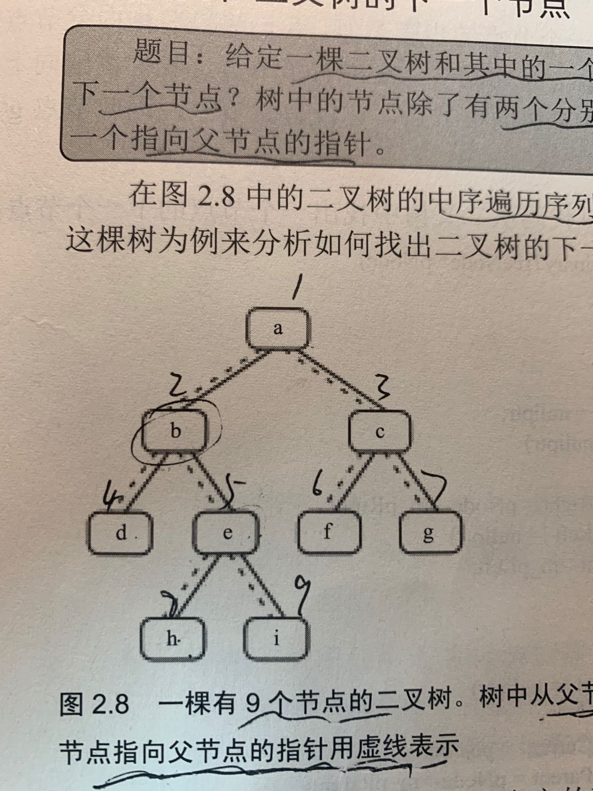

# 题目描述
给定一个二叉树和其中的一个结点，请找出中序遍历顺序的下一个结点并且返回。注意，树中的结点不仅包含左右子结点，同时包含指向父结点的指针。

## 输入1
构建二叉树

    9
    a b d e h i c f g
    d b h e i a f c g

##分析
该二叉树打印中序的下一个节点，有三种情况

- 若有右子树，就是右子树的最左节点
- 若无右子树。
    - 情况一，且是父亲的左子节点，那么下一个节点为父亲
    - 情况二，且是父亲的右子节点，那么下一个节点为父亲节点的儿子是左子节点
        - 比如i，找e是父亲节点的右子节点
        - 找b，是父亲节点的右子节点
        - 找a，是父亲节点的左子节点，那么输出a