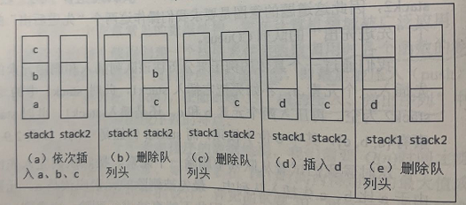
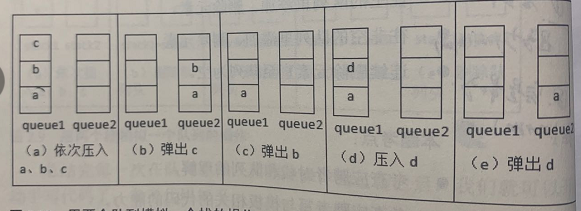

# 题目描述
用两个栈来实现一个队列，完成队列的Push和Pop操作。 队列中的元素为int类型。

## 分析

如图，两个堆栈的开口是上
插入就正常插入堆栈
删除时，需要将堆栈存入另一个堆栈，刚好颠倒了顺序，达到先入先出的效果

## 拓展两个队列实现堆栈

如图队列开口是下
插入时，就正常插入一个队列
删除时，将队列弹出queue1.size() - 1 次，放入queue2。queue1剩下的最后一个元素弹出.

