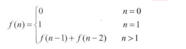
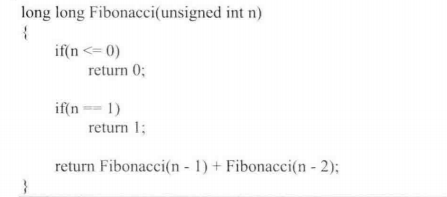
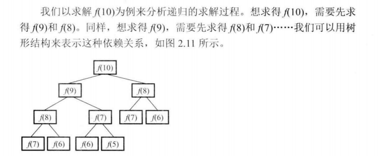
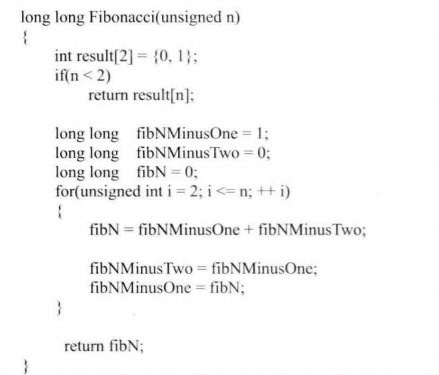
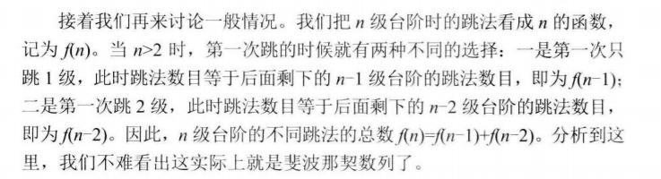
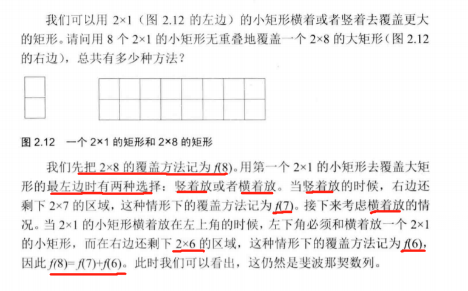

# 题目描述 计算斐波那契数列
大家都知道斐波那契数列，现在要求输入一个整数n，请你输出斐波那契数列的第n项（从0开始，第0项为0）。
n<=39

## 分析

### 不能使用递归解决问题的原因？
构建一种递归的解法

很容易发现，随着深度加深，计算了很多重复项

### 使用另一种思想解决，从0往后构建

# 题目描述 跳台阶
一只青蛙一次可以跳上1级台阶，也可以跳上2级。求该青蛙跳上一个n级的台阶总共有多少种跳法（先后次序不同算不同的结果）。

## 分析
可以发现这其实就是斐波那契数列
如果只有1级台阶，那么只有一种跳法。如果两级，那就是2级跳法

# 题目描述 变态跳台阶
一只青蛙一次可以跳上1级台阶，也可以跳上2级……它也可以跳上n级。求该青蛙跳上一个n级的台阶总共有多少种跳法。

## 分析
可以用穷举发现，跳n次台阶就是$2^{n-1}$

#题目描述
 我们可以用2*1的小矩形横着或者竖着去覆盖更大的矩形。请问用n个2*1的小矩形无重叠地覆盖一个2*n的大矩形，总共有多少种方法？
 
 