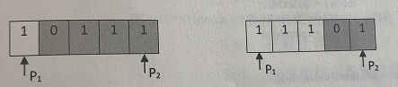

# 题目描述

把一个数组最开始的若干个元素搬到数组的末尾，我们称之为数组的旋转。
输入一个非递减排序的数组的一个旋转，输出旋转数组的最小元素。
例如数组{3,4,5,1,2}为{1,2,3,4,5}的一个旋转，该数组的最小值为1。
NOTE：给出的所有元素都大于0，若数组大小为0，请返回0。

## 分析
旋转之后，数组分为两个有序的序列，其中左序列第一个元素 >  右序列最后一个元素

left = 0   right = length -1
- 可以用二分的方法，使左右区间逼近
- 最终使得left 与 right 相邻
    - left为左序列的最大元素
    - right为右序列右序列的最小元素

此时终止条件可以为left 与 right 相邻 ， 且 right所指位置就是最小的元素(旋点)

若元素有重复的怎么办,下面两个情况，P1,P2,mid 都是1 ,那么就只能顺序遍历查找了

不过我采用的实现是，后面的P2,向前移动一次