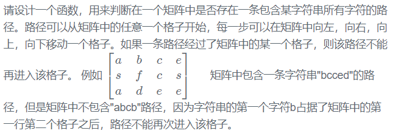

# 题目描述

## 分析
回溯算法

起始的遍历方式是可能可以从任何一个节点进入进行匹配。

判断是否可以进入下一个节点
- 是否超出边界
- 是否是字符串的节点
- 是否已经访问过

是否需要终止？

当匹配到字符串‘\0’ 结束，可是使用strLength作为索引，匹配到+1

是否需要回退？
需要回退，字符串尝试失败，strLength - 1; visit[index] = false;

