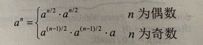
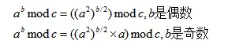

# 题目描述

给定一个double类型的浮点数base和int类型的整数exponent。求base的exponent次方。

保证base和exponent不同时为0

## 分析
分3种情况考虑
- exponent < 0  那么就是$1.0/base^{-n}$  且base不能等于0
- exponent = 0  任何数都是1
- exponent > 0  $base^n$


# 知识点1  double float fabs abs
浮点数：
- 数符(1bit) 代表数的正负
- 指数符占 1 位二进制，表示指数的正负。
- 尾数表示浮点数有效数字，0.xxxxxxx, 但不存开头的 0 和点。
- 指数存指数的有效数字。
- double（64位） 和 float（32位） 的区别是 double 精度高，有效数字 16 位，float 精度 7 位

---

```c
int abs(int i);              //处理int类型的取绝对值
double fabs(double i);      //处理double类型的取绝对值
float fabsf(float i);       //处理float类型的取绝对值
```

# 知识点2 指数快速求法


PowerCore2的实现


# 知识点3 指数爆炸问题
用取模的方式来取后面几位数，比如说mod 1000 取后3位

