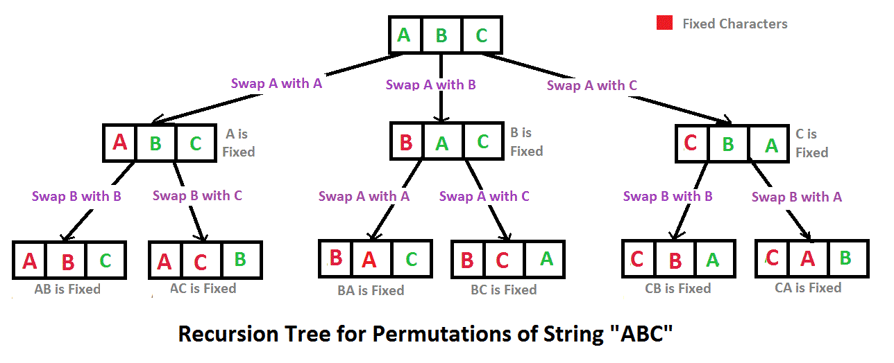

# 字符串的排列 题目描述
输入一个字符串,按字典序打印出该字符串中字符的所有排列。例如输入字符串abc,则打印出由字符a,b,c所能排列出来的所有字符串abc,acb,bac,bca,cab和cba。

## 输入描述:
输入一个字符串,长度不超过9(可能有字符重复),字符只包括大小写字母。

## 分析

- 第一步求所有可能出现在第一个位置的字符
- 第二步递归求剩下的字符

# 扩展
abc 如果不是求字符的所有排列，而是求字符的所有组合。
a,b,c,ab,ac,bc,abc

那么如果是全排列，全组合呢？

## 组合问题
那么应该是用滑动窗口，窗口大小从1开始增长到n。

## 排列+组合问题
对于每一个组合方式，递归调用排列，加入set