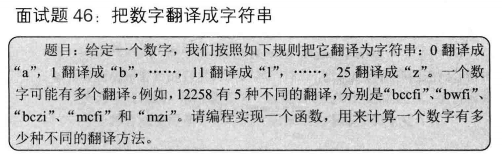
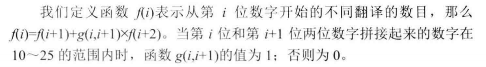

# 把数字翻译成字符串 题目描述

## 分析
这个问题典型的可以使用递归自上而下，但是会有解决重复的子问题。
也可以自下而上解决问题。

### 递归

例如：12258，可以从左至右选择
- 1，2258
- 12，258  但要注意的是，12必须在10-25的范围内才有该情况

子问题情况实例：
- 1，2258
- 2，258 此时的258已经解决过该问题了。

### 动态规划，自下而上解决
示例1：12258
- 8   1 (8)
- 58  1 (5,8)   
- 258 2 (2,58)+(25,8) 
- 2258 3 (2,258)+(22,58)
- 12258 5 (1,2258)+(12,258)

示例2：12222
- 2 1 (2)
- 22 2 (2,2)+(22)
- 222 3 (2,22)+(22,2)
- 2222 5 (2,222)+(22,22)
- 12222 8 (1,2222)+(12,222)